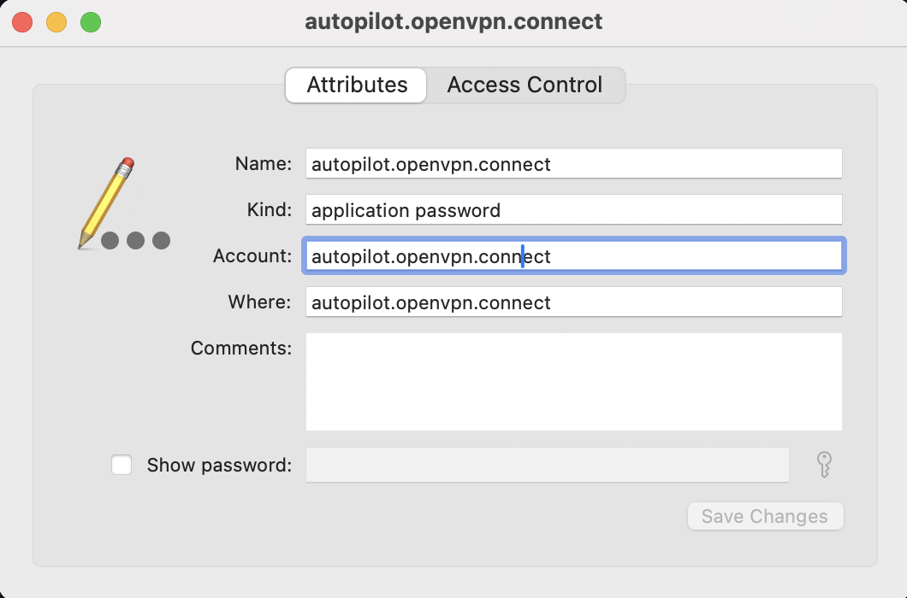

# AutoPilot

<!-- vscode-markdown-toc -->
* 1. [Prerequisites](#Prerequisites)
* 2. [Features](#Features)
	* 2.1. [YubiKey OTP Detection and OpenVPN Connection](#YubiKeyOTPDetectionandOpenVPNConnection)
	* 2.2. [Automatic Input Method Switching](#AutomaticInputMethodSwitching)
* 3. [File Structure](#FileStructure)

<!-- vscode-markdown-toc-config
	numbering=true
	autoSave=true
	/vscode-markdown-toc-config -->
<!-- /vscode-markdown-toc -->


**AutoPilot** is a lightweight Hammerspoon automation toolkit designed to enhance your macOS workflow. It automates tasks such as VPN connection and input method switching, ensuring a smoother and more productive experience.

##  1. <a name='Prerequisites'></a>Prerequisites

[Hammerspoon](https://github.com/Hammerspoon/hammerspoon) is a tool for powerful automation of OS X. At its core, Hammerspoon is just a bridge between the operating system and a Lua scripting engine, enabling users to create custom workflows and automations.

It is recommended to install Hammerspoon via Homebrew:

```bash
brew install --cask hammerspoon
```

After installing Hammerspoon, launch the application to complete the setup process. You will need to grant Hammerspoon the necessary macOS permissions for it to function properly. Additionally, Hammerspoon requires a configuration file to define your automations, located at `~/.hammerspoon/init.lua`.


##  2. <a name='Features'></a>Features

###  2.1. <a name='YubiKeyOTPDetectionandOpenVPNConnection'></a>YubiKey OTP Detection and OpenVPN Connection

In certain corporate OpenVPN setups, users are required to authenticate using a combination of a static password and a dynamic one-time password (OTP). This approach enhances security by ensuring that the password changes with each connection attempt. A YubiKey, a hardware-based security key, generates these OTPs, guaranteeing that only individuals possessing the YubiKey can authenticate successfully. 

For detailed information on how YubiKey OTP works with OpenVPN, visit [OpenVPN OTP Authentication](https://github.com/thesparklabs/openvpn-two-factor-extensions/blob/master/yubikey-otp/openvpn_otp_auth.py).

Automating this process streamlines the workflow, enabling users to establish secure VPN connections without manually entering both static passwords and OTPs.

- **Real-time YubiKey Monitoring**: Listens for button presses on the YubiKey device.  
- **OTP Recognition**: Detects 44-character OTP tokens generated by the YubiKey.  
- **Automated VPN Authentication**: Upon detecting a valid OTP, the script uses AppleScript to launch the OpenVPN Connect application. It then automatically inputs the concatenated password (static password + OTP), streamlining the connection process seamlessly.

To enable this module:

1. Copy the `config/yubikey_otp_openvpn_autoconnect.lua` and `init.lua` files into your `~/.hammerspoon` directory:
    ```bash
    mkdir -p ~/.hammerspoon/config
    cp config/yubikey_otp_openvpn_autoconnect.lua ~/.hammerspoon/config/
    cp init.lua ~/.hammerspoon/
    ```

2. Open the Keychain Access application on macOS and create a new entry to store the OpenVPN static password. The **Account Name** must be set to `autopilot.openvpn.connect`. To verify the setup, run the following command in the terminal to check if the password can be retrieved. If prompted for authorization, click Always Allow to grant access.

    ```bash
    security find-generic-password -a autopilot.openvpn.connect -w
    ```



Once configured, reload Hammerspoon, and the module will automatically connect to the VPN with just a tap on your YubiKey.

###  2.2. <a name='AutomaticInputMethodSwitching'></a>Automatic Input Method Switching

- Monitors active applications.
- Dynamically switches input methods based on app-specific preferences.

#TODO


##  3. <a name='FileStructure'></a>File Structure

- `init.lua`: Main entry point for the script, integrates all features.
- `config/yubikey_otp_openvpn_autoconnect.lua`: Handles YubiKey OTP detection and OpenVPN connection logic.
- `README.md`: Documentation.

